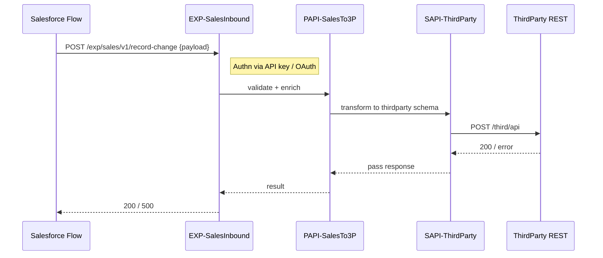
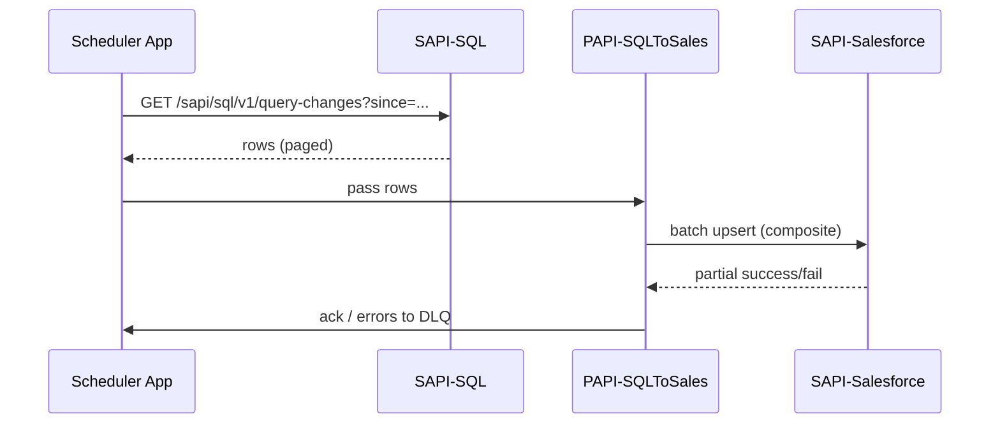

# MuleSoft HLD 

## Summary

We will implement an API-led architecture with three layers:

* **System APIs** — canonical adapters to systems of record (Salesforce, ThirdParty REST API, SQL DB).
* **Process APIs** — orchestration and transformation; reusable business logic.
* **Experience / Orchestration APIs** — interfaces targeted at consumers (Salesforce Flow HTTP endpoint, Scheduler job).

Two integration flows are required:

1. **Salesforce -> MuleSoft -> ThirdParty**: on record change in Salesforce a Flow will call an Experience API (HTTP listener in Mule) -> authenticated -> logged -> Process API will transform and call ThirdParty System API (handles auth + call). Responses are returned to Salesforce and logged.
2. **SQL -> MuleSoft Scheduler -> Salesforce**: scheduled Mule app (cron) will call the SQL System API (JDBC) to extract changed/new rows, Process API transforms into Salesforce object payloads and calls the Salesforce System API to upsert records.

---

## High Level Architecture (text + diagram)

```mermaid
flowchart LR
  subgraph SalesforceSide
    SFlow[Salesforce Flow / Platform Event]
  end
  subgraph MuleAnypoint
    direction TB
    EXP_Salesforce[Experience API (HTTP listener)\n/mule-apps/exp-salesforce]
    PROC_SP[Process API: SalesToThirdParty\n/mule-apps/proc-sales-3p]
    SAPI_Third[System API: ThirdParty-REST\n/mule-apps/sapi-third]
    SAPI_SF[System API: Salesforce-Connector\n/mule-apps/sapi-salesforce]
    SAPI_SQL[System API: SQL-DB (JDBC)\n/mule-apps/sapi-sql]
    SCHED[Scheduler App\n/mule-apps/sched-sql-extract]
    MQ[Anypoint MQ or DLQ]
    LOGS[Logging & Audit (Elastic / Splunk)]
    API_GATEWAY[API Gateway / Manager]
  end

  SFlow -->|HTTP POST /v1/sales/record-change| EXP_Salesforce --> PROC_SP --> SAPI_Third --> ThirdParty[ThirdParty REST]
  ThirdParty -->|200/4xx/5xx| SAPI_Third --> PROC_SP --> EXP_Salesforce --> SFlow

  SCHED -->|cron| SAPI_SQL --> PROC_SP --> SAPI_SF --> Salesforce
  SAPI_SF -->|200/4xx/5xx| PROC_SP --> MQ

  EXP_Salesforce --- API_GATEWAY
  SAPI_Third --- API_GATEWAY
  SAPI_SF --- API_GATEWAY
  LOGS --- EXP_Salesforce
  LOGS --- SCHED
```

---

## Naming conventions

Use predictable names for apps, APIs, and artifacts for discoverability and management:

* Mule App names: `org.domain.layer-purpose-environment` e.g. `acme.system.thirdparty-rest-prod` (or `acme-sapi-thirdparty-rest-prod`).
* Maven artifactId: `acme-<layer>-<purpose>` e.g. `acme-sapi-thirdparty-rest`.
* API names (Anypoint Exchange): `<Org> - <Layer> - <Purpose> - <API Version>` e.g. `ACME - SAPI - ThirdParty REST - v1`.
* RAML / OAS files: `sapi-thirdparty-rest-1.0.raml` or `proc-sales-to-thirdparty-1.0.oas`.
* Properties files: `dev.properties`, `test.properties`, `prod.properties` stored in secure manager.
* Logging correlation id: `X-Correlation-ID: <org>-<app>-<uuid>`.

---

## APIs & responsibilities

### System APIs

* **SAPI - Salesforce (acme-sapi-salesforce)**

  * Purpose: Wrapper for Salesforce REST API (sObject upsert, composite). Centralizes SF auth and rate-limit handling.
  * Exposes: `/sapi/salesforce/v1/upsert`, `/sapi/salesforce/v1/query`.
  * Auth: Client credentials or JWT using a named credential; secrets in secure properties.

* **SAPI - ThirdParty REST (acme-sapi-thirdparty-rest)**

  * Purpose: Handle 3rd-party auth (API keys, OAuth), retries, and circuit-breaker logic.
  * Exposes: `/sapi/thirdparty/v1/post-job`.

* **SAPI - SQL DB (acme-sapi-sql-db)**

  * Purpose: JDBC adapter for scheduled reads. Exposes parameterized query endpoints for the scheduler.
  * Exposes: `/sapi/sql/v1/query-changes?since=YYYY-MM-DDThh:mm`.

### Process APIs

* **PAPI - SalesToThirdParty (acme-proc-sales-to-3p)**

  * Purpose: Orchestrate Salesforce inbound payloads, enrich/transform into ThirdParty schema, apply business rules, call SAPI-ThirdParty.
  * Responsibilities: Validation, DataWeave transform, idempotency checks (dedupe store), error classification.

* **PAPI - SQLToSales (acme-proc-sql-to-sales)**

  * Purpose: Read SQL results, transform to Salesforce object model, batch for upsert to SAPI-Salesforce.
  * Responsibilities: Pagination, chunking, batching, transform mapping, partial-failure handling.

### Experience / Exposure APIs

* **EXP - SalesInbound (acme-exp-sales-inbound)**

  * Purpose: HTTP listener for Salesforce Flow to POST record-change events. Lightweight validation and auth.
  * Endpoint: `POST /exp/sales/v1/record-change`

* **SCHED App**

  * Purpose: Cron-based trigger that calls `SAPI - SQL` to retrieve changes and passes to `PAPI - SQLToSales`.

---

## Sequence diagrams

### Salesforce -> Mule -> ThirdParty (simplified)



### Scheduler SQL extract -> Salesforce upsert (simplified)



---

## Data model / message contracts (examples)

### Salesforce -> EXP (example JSON sent by Salesforce Flow)

```json
{
  "correlationId": "ACME-SALES-1234-uuid",
  "eventType": "Account.Updated",
  "record": {
    "Id": "001xx000003NGs1AAG",
    "Name": "Acme Ltd",
    "BillingAddress": {...}
  },
  "changedFields": ["BillingAddress", "Phone"]
}
```

### ThirdParty payload (example)

```json
{
  "clientId": "001xx000003NGs1AAG",
  "companyName": "Acme Ltd",
  "address": {
    "line1": "...",
    "city": "..."
  }
}
```

### SQL result row -> Salesforce upsert (example)

```json
{
  "external_id__c": "ext-123",
  "name": "John Smith",
  "email": "john.smith@example.com",
  "tenancy_start__c": "2025-01-01"
}
```

---

## Security

* **Transport**: TLS 1.2+ for all endpoints.
* **Authentication**:

  * Salesforce -> EXP: use OAuth bearer token or Mutual TLS; prefer signed JWT / Named Credential.
  * Mule -> ThirdParty: use stored credentials in Anypoint Secrets Manager; rotate regularly.
* **Authorization**: scoping by API key or OAuth scopes.
* **Secrets**: store in Anypoint Secrets Manager / secure properties, never plain text.
* **Network**: lock down to VPC/Private Space where required (for on-prem SQL access use VPN/Private Link).

---

## Error handling & retries

* **Client errors (4xx)**: return to caller with meaningful error codes. Log and mark as business error (no retry).
* **Server errors (5xx)**: implement retry policy with exponential backoff in System APIs; after `N` attempts push to DLQ (Anypoint MQ) and create an incident ticket.
* **Idempotency**: implement idempotency via `X-Idempotency-Key` (or storing processed event ids) for duplicate event prevention.
* **Partial failures**: when batching to Salesforce, use Composite API and handle partial successes — enqueue failures for retry with context.

---

## Logging & auditing

* Every request should carry `X-Correlation-ID` and `X-Request-TS`.
* Structured logs (JSON) with at least: correlationId, apiName, operation, status, elapsedMs, ownerApp.
* Send logs to ELK / Splunk or Anypoint Monitoring. Store audit events of critical operations in a durable store or send to MQ for downstream processing.

---

## Observability & Alerts

* Anypoint Monitoring dashboards for:

  * Request rate / latency per API.
  * Error rate (4xx/5xx) per endpoint.
  * Downstream third-party SLA breaches.
* Alerts: high error rate, queue depth in DLQ, repeated authentication failures.

---

## Non-functional requirements

* Throughput: sized for expected spikes (give numbers if you have them). Use batching & concurrent processing.
* SLA: e.g., 99.5% success for day-to-day operations.
* Latency: sync calls from Salesforce should respond within 2–3 seconds where possible; longer-running work can be asynchronous.

---
